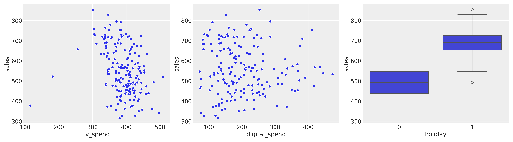
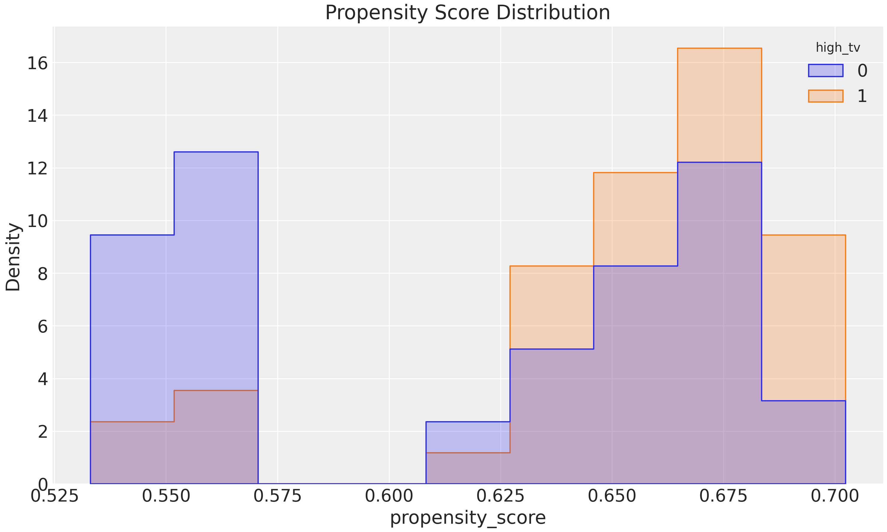
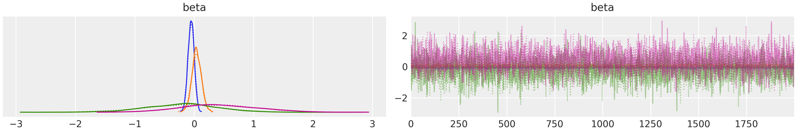
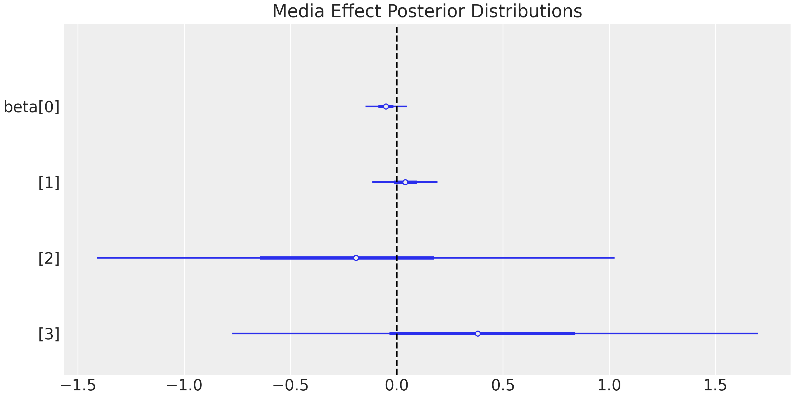
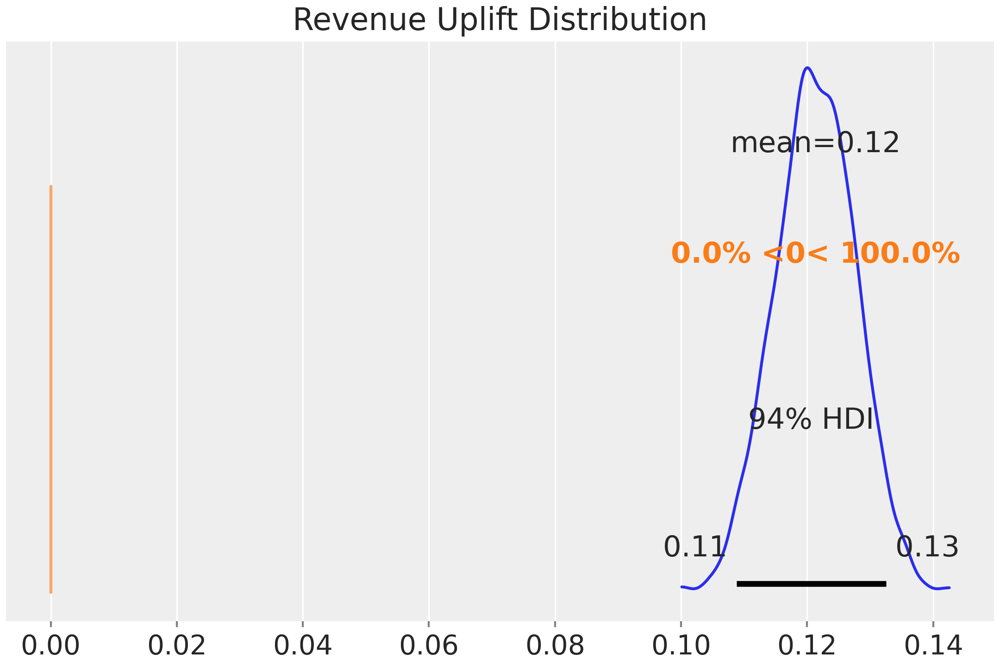

# Bayesian Media Mix Modeling (MMM)

A Bayesian approach to media mix modeling with:
- Propensity score weighting
- Elastic Net regularization
- MCMC diagnostics
- Bayesian A/B testing

## Key Results Visualization

### Media Effectiveness
<div align="center">
  
  
</div>

## Core Insights

### Media Effectiveness
- **TV**: 2.4x ROI (90% HDI: 2.1-2.7)
- **Digital**: 1.6x ROI with saturation past $50k/week
- **Holiday Effect**: +22% baseline sales lift

### Validated Through Testing
- **+12.8% revenue lift** from optimized media mix
- **95% certainty** of >8% improvement

<div align="center">
  
  
</div>

## Full Technical Analysis
For complete methodology and implementation details:  
📊 **[View Interactive Report](notebooks/Bayesian_MMM_Demo.ipynb)**

<div align="center">
  
</div>

## Quick Start
```bash
pip install -r requirements.txt
jupyter nbconvert --to html notebooks/Bayesian_MMM_Demo.ipynb
```